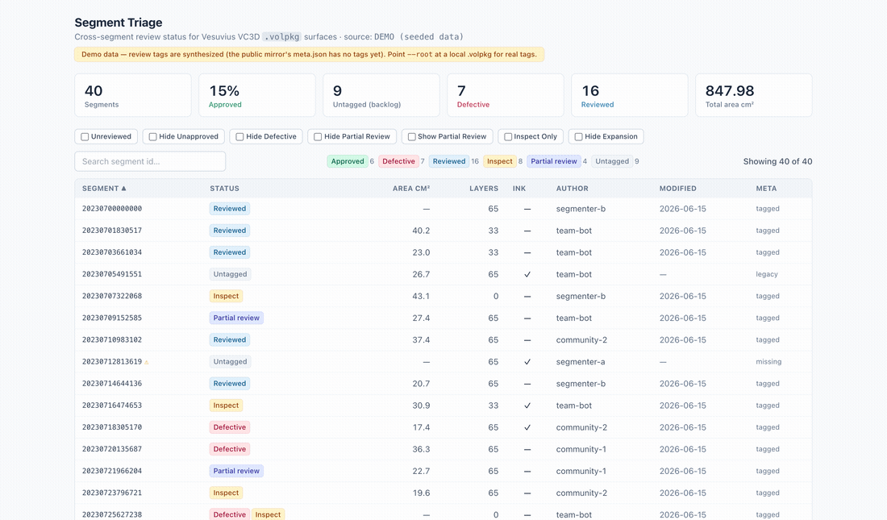

# vesuvius-segment-triage

[](https://github.com/VECTRION-HQ/vesuvius-segment-triage/actions/workflows/ci.yml) · MIT · zero-dependency local install · 68 tests (44 Python + 24 TypeScript) — filter logic parity-tested against VC3D source.

**A cross-segment review-status triage dashboard for [Vesuvius Challenge](https://scrollprize.org) VC3D `.volpkg` surfaces.**

VC3D (volume-cartographer) lets a segmenter tag each surface `approved` / `defective` /
`reviewed` / `inspect` / `partial_review` — but those tags can only be filtered **one
segment at a time, inside the desktop app**. `vesuvius-segment-triage` crawls a whole
`.volpkg`, reads every segment's `meta.json` review tags plus a few useful metrics, and
renders **one filterable, sortable web table** so you can answer at a glance:

> *Across this scroll, what's approved vs defective vs untouched — and what needs review next?*

It's a single, read-only command that produces a self-contained HTML file you can open or share. No server, no data download.



**▶ Live demo (seeded data, click the filters):** https://vectrion-hq.github.io/vesuvius-segment-triage/

**See it in action:** ① whole-scroll status at a glance · ② click a stat card or `Unreviewed` to isolate the backlog · ③ sort by area to triage the biggest surfaces first · ④ `Hide Unapproved` to see only what's signed off.

---

## Why this exists

Review status is tracked today in [several separate viewers](https://scrollprize.org/community_projects)
and inside VC3D itself, with no whole-scroll overview of *what has been reviewed*. The tags
already exist in each surface's `meta.json` (written by VC3D's
[`SurfacePanelController`](https://github.com/ScrollPrize/villa/blob/main/volume-cartographer/apps/VC3D/SurfacePanelController.cpp));
this tool simply surfaces them across every segment at once. It mirrors VC3D's exact filter
set so what you see here matches what you'd see filtering in the app — just for the whole scroll.

It complements VC3D rather than replacing it: **VC3D writes the tags, this reads them.** Hand the
annotation team a clean "approved" list; spot the defective/untagged backlog without clicking
through hundreds of segments.

## 30-second quickstart

```bash
git clone https://github.com/VECTRION-HQ/vesuvius-segment-triage
cd vesuvius-segment-triage
pip install .            # zero third-party deps for local mode; web UI is prebuilt & bundled

# 1) Try it immediately on seeded demo data (no download):
segment-triage demo -o demo.html && open demo.html

# 2) Run it on your own VC3D working copy (this is where real tags live):
segment-triage scan --root /path/to/PHercParis4.volpkg -o triage.html && open triage.html
```

That's it — `triage.html` is self-contained; email it, drop it in Discord, or commit it.

> **Heads-up:** scanning the **public mirror** shows every segment as **Untagged** — that's expected. Published `meta.json` is the legacy, tag-less format; real review tags live in a team member's **local `.volpkg`**. Area, author, layers and created-date work either way.

## Usage

```bash
segment-triage scan --root <PATH-OR-URL> [-o out.html] [--limit N] [--strict] [--json manifest.json]
segment-triage demo [-o demo.html]
segment-triage write-demo-volpkg <dir>     # write a real demo .volpkg/paths tree to inspect/crawl
```

`--root` accepts:
- a **`.volpkg`** directory (it looks in `paths/`),
- a **`paths/`** directory or a **single segment** folder,
- an **http(s) mirror URL** (e.g. a `…/PHercParis4.volpkg/paths/` listing on `dl.ash2txt.org`).

Options: `--limit` caps how many segments are crawled, `--workers N` sets remote-crawl
concurrency (default 8), `--strict` fails on a malformed `meta.json` (default is
warn-and-continue), `--json` also writes the raw manifest.

When scanning an http mirror, each segment id links to its folder on the data server,
so you can jump straight to a segment's files. `_superseded` / `_test` segments are
detected and hidden by default (toggle to show them). Verified end-to-end on the live
public mirror (`…/PHercParis4.volpkg/paths/`, the legacy tag-less format).

> Http-mirror scans need the optional extra: `pip install "vesuvius-segment-triage[remote]"`. Local `.volpkg` scans and the demo stay zero-dependency.

### Filters (identical to VC3D's surface-tree filters)

| Filter | Keeps a segment when… |
| --- | --- |
| **Unreviewed** | it is **not** tagged `reviewed` (the review backlog) |
| **Hide Unapproved** | it **is** tagged `approved` |
| **Hide Defective** | it is **not** tagged `defective` |
| **Hide Partial Review** | it is **not** tagged `partial_review` *or* `reviewed` |
| **Show Partial Review** | it **is** tagged `partial_review` *or* `reviewed` |
| **Inspect Only** | it **is** tagged `inspect` |
| **Hide Expansion** | its `vc_gsfs_mode` is not `expansion` |

These predicates are verified against VC3D source and unit-tested on both the Python and
TypeScript sides from one shared fixture ([`tests/filter_cases.json`](tests/filter_cases.json)).

## What it reads

For each segment under `paths/`:

| From `meta.json` | Fallback / derived |
| --- | --- |
| `tags` → review statuses (+ user/date) | empty/absent → **Untagged** bucket (never dropped) |
| `area_cm2`, `author`, `date_last_modified`, `vc_gsfs_mode`, `avg_cost`, `uuid`, `volume` | `area_cm2.txt`, `author.txt` |
| | **created** date parsed from the `YYYYMMDDHHMMSS` segment id (works on legacy public data too) |
| | layer count from `layers/*.tif` (counted, **not** downloaded) |
| | rendered mesh present? (`*.obj`) · ink prediction present? (`*_prediction*.png`, `*inklabel*.png`) |
| | superseded? (`_superseded` / `_test` in the id) |

It is **read-only** and reads **metadata only** — it never modifies, downloads, or redistributes
scroll data. Writing tags is VC3D's job.

> **Note on public data:** the published mirror's `meta.json` files are the legacy format and
> don't carry review `tags` yet — those live in your local VC3D `.volpkg`. Point `--root` at a
> local `.volpkg` to see real tags; the `demo` command uses clearly-labeled synthesized tags so
> you can try the UI without any data.

## Development

```bash
# Python
pip install -e ".[dev]"
pytest

# Frontend (React + TypeScript + Tailwind, bundled to a single file)
cd frontend
npm install
npm test          # filter parity tests
npm run build     # builds + copies the bundle into segment_triage/web/template.html
```

The frontend builds to **one self-contained HTML file** (via `vite-plugin-singlefile`) that the
Python report writer injects the crawl manifest into.

## License

[MIT](LICENSE) © 2026 Aakash Kapoor. Built for the Vesuvius Challenge community.
